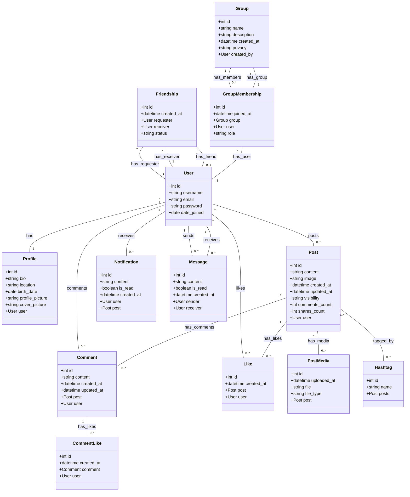

A Django application with complex social media-like functionality, here are the essential fields and relationships for models like `User`, `Post`, `Comment`, `Like`, and others. I'll cover various features for an application similar to Facebook or Twitter.

### 1. **User Model**

- Django’s built-in `User` model or a custom user model with:
  - `username`
  - `email`
  - `profile_picture`
  - `bio`
  - `location`p
  - `friends` (Many-to-Many relationship with itself, for friend connections)
  - `followers` and `following` (for a Twitter-like following system)

### 2. **Profile**

- Additional user details:
  - `user` (One-to-One with `User`)
  - `profile_picture`
  - `cover_picture`
  - `bio`
  - `location`
  - `birth_date`

### 3. **Post Model**

- Main content for users:
  - `user` (ForeignKey to `User`)
  - `content` (TextField, for post text)
  - `image` (ImageField, optional for post images)
  - `created_at` (DateTimeField, auto_now_add=True)
  - `updated_at` (DateTimeField, auto_now=True)
  - `visibility` (ChoiceField, e.g., `Public`, `Friends`, `Private`)
  - `likes` (Many-to-Many with `User`, through `Like` model for like functionality)
  - `comments_count` (Integer, to optimize comment count display)
  - `shares_count` (Integer, to optimize share count display)

### 4. **Comment Model**

- For comments on posts:
  - `user` (ForeignKey to `User`)
  - `post` (ForeignKey to `Post`)
  - `content` (TextField)
  - `created_at` (DateTimeField, auto_now_add=True)
  - `updated_at` (DateTimeField, auto_now=True)
  - `likes` (Many-to-Many with `User`, for comment likes)

### 5. **Like Model**

- Tracks likes for posts and comments:
  - `user` (ForeignKey to `User`)
  - `post` (ForeignKey to `Post`, null=True)
  - `comment` (ForeignKey to `Comment`, null=True)
  - `created_at` (DateTimeField, auto_now_add=True)

### 6. **Friendship Model**

- To handle friend connections:
  - `requester` (ForeignKey to `User`, related_name="friend_requests_sent")
  - `receiver` (ForeignKey to `User`, related_name="friend_requests_received")
  - `status` (ChoiceField: `Pending`, `Accepted`, `Declined`)
  - `created_at` (DateTimeField, auto_now_add=True)

### 7. **Notification Model**

- For user notifications:
  - `user` (ForeignKey to `User`, for whom the notification is)
  - `content` (TextField, describing the notification)
  - `post` (ForeignKey to `Post`, null=True, if notification is about a post)
  - `is_read` (Boolean, to track if the notification is read)
  - `created_at` (DateTimeField, auto_now_add=True)

### 8. **Message Model**

- For direct messages:
  - `sender` (ForeignKey to `User`, related_name="sent_messages")
  - `receiver` (ForeignKey to `User`, related_name="received_messages")
  - `content` (TextField)
  - `created_at` (DateTimeField, auto_now_add=True)
  - `is_read` (BooleanField, default=False)

### 9. **Post Media Model**

- For handling multiple images or videos in a post:
  - `post` (ForeignKey to `Post`)
  - `file` (FileField, for images or videos)
  - `file_type` (ChoiceField: `Image`, `Video`)
  - `uploaded_at` (DateTimeField, auto_now_add=True)

### 10. **Hashtag Model**

- For hashtag support:
  - `name` (CharField)
  - `posts` (Many-to-Many with `Post`, for all posts using the hashtag)

### 11. **Group and Group Membership Models**

- For creating groups and group memberships:
  - **Group**: `name`, `description`, `created_by` (user), `privacy` (public/private)
  - **GroupMembership**: `group`, `user`, `role` (admin/member), `joined_at`

### 12. **Reactions Model**

- To handle multiple reaction types:
  - `user` (ForeignKey to `User`)
  - `post` (ForeignKey to `Post`)
  - `type` (ChoiceField, e.g., `Like`, `Love`, `Wow`, `Sad`, `Angry`)

These models and fields will allow your Django app to replicate core social media features such as posts, comments, likes, media uploads, friends, groups, messaging, and notifications. Let me know if you'd like help setting up any of these specific models!

